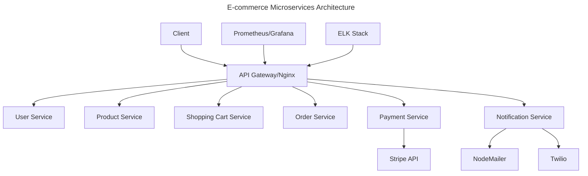

# Scalable E-commerce Backend (Microservices)

A scalable e-commerce platform built with microservices architecture. The platform provides comprehensive e-commerce functionality including user management, product catalog, shopping cart, order processing, payments, and notifications.

Project Link : https://roadmap.sh/projects/scalable-ecommerce-platform

## Architecture Overview



## Features

### Core Services
- **User Service**: Authentication, authorization, profile management
- **Product Service**: Catalog management, inventory, search
- **Shopping Cart Service**: Cart management, session handling
- **Order Service**: Order processing, status tracking
- **Payment Service**: Secure payment processing via Stripe
- **Notification Service**: Email/SMS notifications via NodeMailer/Twilio

### Infrastructure
- **API Gateway**: Request routing and load balancing
- **Monitoring**: Real-time metrics and alerting
- **Logging**: Centralized logging with full-text search
- **Containerization**: Docker-based deployment
- **CI/CD**: Automated testing and deployment

## Tech Stack

### Backend
- Node.js/Express.js
- MongoDB with Mongoose ODM
- JWT for authentication
- bcrypt for password hashing

### Infrastructure
- Docker & Docker Compose
- Nginx (API Gateway/Load Balancer)
- Stripe API

### Monitoring & Logging
- Prometheus & Grafana
- ELK Stack (Elasticsearch, Logstash, Kibana)

## Getting Started

### Prerequisites
- Docker Engine 24.0+
- Docker Compose 2.20+
- Node.js 18+ (for local development)
- MongoDB 6.0+ (for local development)

### Environment Setup

1. Clone the repository:
```bash
git clone https://github.com/Toheed07/Scalable-E-Commerce-Platform.git
cd Scalable-E-Commerce-Platform
```

2. Create and Configure environment files for each service.


### Running the Application

#### Docker Deployment
```bash
# Start core services
docker compose up -d

# Start monitoring stack
cd monitoring
docker compose up -d
```

### Service Endpoints

| Service | Internal Port | External Port | Endpoint |
|---------|--------------|---------------|-----------|
| API Gateway | 80 | 8080 | http://localhost:8080 |
| User Service | 4000 | 4000 | /v1/api/users/* |
| Product Service | 4001 | 4001 | /v1/api/products/* |
| Cart Service | 4002 | 4002 | /v1/api/cart/* |
| Payment Service | 4003 | 4003 | /v1/api/payments/* |
| Order Service | 4004 | 4004 | /v1/api/orders/* |
| Notification Service | 4005 | 4005 | /v1/api/notification/* |
| Grafana | 3000 | 3000 | http://localhost:3000 |
| Kibana | 5601 | 5601 | http://localhost:5601 |

## Monitoring & Observability

### Grafana Dashboards
- Access: http://localhost:3000
- Default credentials: admin/admin

### Logging (ELK Stack)
- Kibana: http://localhost:5601


## Contributing

Contributions are welcome! Please fork the repository and create a pull request with your changes.

## Future Plans

- Kubernetes deployment support
- Message queue integration
- Enhanced analytics
